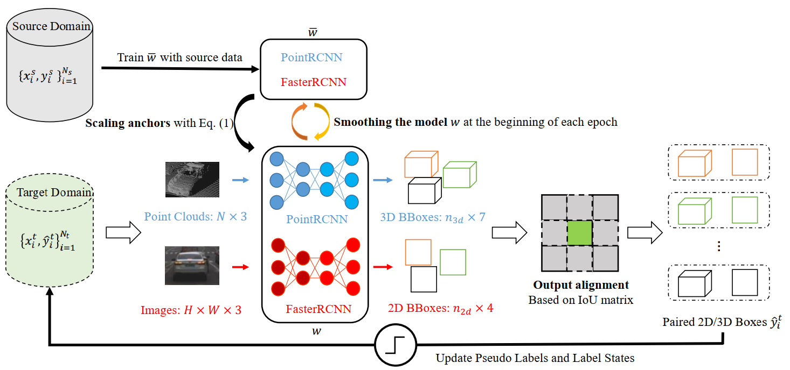

# JST
code release for the paper **JST: Joint Self-training for Unsupervised Domain Adaptation on 2D&3D Object Detection**


# Introduction

**JST** aims to transfer 2D&3D detectors trained in the source domain to the target domain at the same time. The paper is being submitted to [ICRA 2022](https://www.icra2022.org/) . We will release our paper as soon as possible. 

This repo is an implementation of our **JST** framework with PyTorch (v1.6.0). The implementation is based on [OpenPCDet](https://github.com/open-mmlab/OpenPCDet) and [Detectron2](https://github.com/facebookresearch/detectron2).
# Benchmark
KITTI->Lyft

|             | AP_3D(easy) | AP_3D(moderate) | AP_3D(hard) | AP_2D | model                                                        |
| ----------- | :---------: | :-------------: | :---------: | :---: | ------------------------------------------------------------ |
| source only |    30.58    |      21.54      |    20.80    | 39.09 | [model](https://drive.google.com/file/d/1x-qDg2M6Kslx6RqldSe8wmj_2nSL2_53/view?usp=sharing) |
| JST         |    68.96    |      54.89      |    53.50    | 47.89 | [model](https://drive.google.com/file/d/1I-ENqmzqT8-ZQbc2ERZa2ZJjYRr0jeSI/view?usp=sharing) |


Lyft->KITTI

|             | AP_3D(easy) | AP_3D(moderate) | AP_3D(hard) | AP_2D | model                                                        |
| ----------- | :---------: | :-------------: | :---------: | :---: | ------------------------------------------------------------ |
| source only |    64.09    |      49.71      |    45.05    | 63.14 | [model](https://drive.google.com/file/d/1ot0m2qalUqan-a9SgRYv9f_wcDxf3E6G/view?usp=sharing) |
| JST         |    76.19    |      64.87      |    60.46    | 71.34 | [model](https://drive.google.com/file/d/1HdvZZqt9ra7dnbLbHyCG5oU9_R3CLthj/view?usp=sharing) |

KITTI->TinySUScape

|             | AP_3D(easy) | AP_3D(moderate) | AP_3D(hard) | AP_2D | model                                                        |
| ----------- | :---------: | :-------------: | :---------: | :---: | ------------------------------------------------------------ |
| source only |    17.18    |      16.39      |    16.39    | 52.89 | [model](https://drive.google.com/file/d/1cVVDWwsI6Xawq1_KTGvyK0XaUzB6CAYC/view?usp=sharing) |
| JST         |    38.09    |      37.02      |    37.02    | 50.24 | [model](https://drive.google.com/file/d/15c-j2r2X_2NzZddgYQgxy_9I3U_DJCMI/view?usp=sharing) |

Lyft->TinySUScape

|             | AP_3D(easy) | AP_3D(moderate) | AP_3D(hard) | AP_2D | model                                                        |
| ----------- | :---------: | :-------------: | :---------: | :---: | ------------------------------------------------------------ |
| source only |    37.32    |      36.31      |    36.31    | 50.34 | [model](https://drive.google.com/file/d/1K5vSDPLaWFdOB6aVjKg-AJciemUgj11U/view?usp=sharing) |
| JST         |    53.02    |      51.43      |    51.43    | 53.62 | [model](https://drive.google.com/file/d/1nuCo-FpawcjFRm1CMO70R4wUyo22oewg/view?usp=sharing) |

# Installation

All the codes are tested in the following environment:

- python 3.7

-  PyTorch 1.6.0
- CUDA 10.2

a. Clone this repository

```
git clone https://github.com/guangyaooo/JointRCNN.git
```

 b. Install the dependent libraries as follows:

```
pip install -r requirements.txt 
```

c. Install other dependencies

```
python setup.py develop
```

Note that, due to the poor compatibility of spconv, we removed all modules related to spconv in  [OpenPCDet](https://github.com/open-mmlab/OpenPCDet.git). 

d. Follow [object detection metrics](https://github.com/rafaelpadilla/review_object_detection_metrics) to install the 2D detection evaluation tool

# Data Preparation

We evaluate our method on three datasets:

- [KITTI object detection 3D dataset](http://www.cvlibs.net/datasets/kitti/eval_object.php?obj_benchmark=3d)
- [Lyft Level 5 dataset v1.02](https://self-driving.lyft.com/level5/data/)
- [TinySUScape](https://drive.google.com/drive/folders/1eSpyE044SwUk3QRMmdAoYDc1p2Pc_QJA?usp=sharing)

Please refer to [3D_adapt_auto_driving](https://github.com/cxy1997/3D_adapt_auto_driving#usage) to prepare the KITTI and Lyft dataset, [TinySUScape](https://drive.google.com/drive/folders/1eSpyE044SwUk3QRMmdAoYDc1p2Pc_QJA) is already organized in KITTI format.  The train/val split txt of KITTI and Lyft used in our experiments is same as the [3D_adapt_auto_driving](https://github.com/cxy1997/3D_adapt_auto_driving#usage).

The final datasets will be organized as the following structure:

<pre>
dataset_path/
    | kitti/               # KITTI object detection 3D dataset
    	| ImageSets/
    		| train.txt		# training and validation split
    		| val.txt
    	|training/
    		| calib
    		| image_2
    		| label_2
    		| velodyne
    | lyft/               # Lyft object detection 3D dataset
    	| ImageSets/
    		| train.txt		# training and validation split
    		| val.txt
    	|training/
    		| calib
    		| image_2
    		| label_2
    		| velodyne
    | sustc/               # TinySUScape object detection 3D dataset
    	| ImageSets/
    		| train.txt		# training and validation split
    		| val.txt
    	|training/
    		| calib
    		| image_2
    		| label_2
    		| velodyne
</pre>

Next, create a softlink in the root of the Project

```
ln -s dataset_path root/of/the/project/data
```

Build datasets for the PointRCNN

```
cd script
python -m gen_data_info ../tools/cfgs/dataset_configs/kitti_dataset.yaml
python -m gen_data_info ../tools/cfgs/dataset_configs/lyft_kitti_format_dataset.yaml
python -m gen_data_info ../tools/cfgs/dataset_configs/sustc_kitti_format_dataset.yaml
```

# Testing

The dataset configs are located within `tools/cfgs/dataset_configs`, and the model configs are located within `tools/cfgs/xxx_models` for different datasets.

- Test with a  pretrained model:

```
python test.py --cfg_file ${CONFIG_FILE} --batch_size 2 --ckpt ${CKPT}
```

- To test all the saved checkpoints of a specific training setting, add the `--eval_all` argument:

```
python test.py --cfg_file ${CONFIG_FILE} --batch_size 2 --eval_all --ckpt_dir ${CKPT_DIR}
```


# Training

1. We start from training a model in the source domain (such as KITTI). 

```
cd tools
python train.py --cfg_file cfgs/kitti_models/fusion_rcnn_kitti_anchor.yaml --batch_size 3 --epochs 70
```
Note that, KITTI training set only contains less than 4000 images, so we load a pretrained model weight for the FasterRCNN branch. Please download the model weight trained on cityscape from [R50-FPN, Cityscapes](https://dl.fbaipublicfiles.com/detectron2/Cityscapes/mask_rcnn_R_50_FPN/142423278/model_final_af9cf5.pkl), and update the weight path `MODEL.IMAGE_BRANCH_WEIGHT`  in `cfgs/kitti_models/fusion_rcnn_kitti_anchor.yaml`. For the Lyft dataset, we trained the whole model from scratch.

2. Generate pseudo labels on target domain for the first epoch. Then update `DATA_CONFIG.FAKE_BOX_PATH` in the `cfgs/lyft_models/fusion_rcnn_lyft_anchor_st.yaml` 

```
python test.py --split train --cfg_file cfgs/lyft_models/fusion_rcnn_lyft_anchor_st.yaml --batch_size 2 --ckpt ${CKPT} --save_preds --set_cfgs MODEL.POST_PROCESSING.FUSION True MODEL.POST_PROCESSING.STRATEGY 9
```

3. Transfer the model trained in the source domain to the target domain (such as Lyft).

```
python train.py --cfg_file cfgs/lyft_models/fusion_rcnn_lyft_anchor_st.yaml --using_lookahead --model_smoothing --batch_size 3 --epochs 15 --pretrained_model ${CKPT}
```

# Acknowledgement

Our code is based on  [OpenPCDet](https://github.com/open-mmlab/OpenPCDet) and [Detectron2](https://github.com/facebookresearch/detectron2). Thanks for their awesome codebase.
